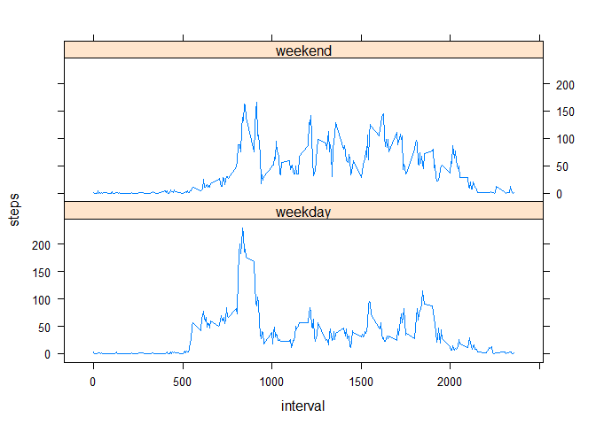

# Reproducible Research: Peer Assessment 1


## Loading and preprocessing the data

Loading libraries  
using readr to set the data in tabular format in one step

```r
library(readr)
```

```
## Warning: package 'readr' was built under R version 3.3.2
```

```r
library(dplyr)
```

```
## Warning: package 'dplyr' was built under R version 3.3.2
```

```
## 
## Attaching package: 'dplyr'
```

```
## The following objects are masked from 'package:stats':
## 
##     filter, lag
```

```
## The following objects are masked from 'package:base':
## 
##     intersect, setdiff, setequal, union
```

```r
library(lattice)
activity <- read_csv("activity.zip")
```

```
## Parsed with column specification:
## cols(
##   steps = col_integer(),
##   date = col_date(format = ""),
##   interval = col_integer()
## )
```


## What is mean total number of steps taken per day?

```r
meanSteps <-mean(activity$steps, na.rm = TRUE)
```
The average mean steps is 37.3825996

 Histogram of the total number of steps taken each day

```r
actDay <- summarize(group_by(activity, date), steps=sum(steps, na.rm = TRUE))

with( actDay, hist(steps, breaks = 10))
```

<!-- -->

Mean and median number of steps taken each day

```r
actDayMM <- summarize(group_by(activity, date), stepsMean=mean(steps, na.rm = TRUE), stepsMedian=median(steps, na.rm = TRUE))
actDayMM
```

```
## # A tibble: 61 × 3
##          date stepsMean stepsMedian
##        <date>     <dbl>       <dbl>
## 1  2012-10-01       NaN          NA
## 2  2012-10-02   0.43750           0
## 3  2012-10-03  39.41667           0
## 4  2012-10-04  42.06944           0
## 5  2012-10-05  46.15972           0
## 6  2012-10-06  53.54167           0
## 7  2012-10-07  38.24653           0
## 8  2012-10-08       NaN          NA
## 9  2012-10-09  44.48264           0
## 10 2012-10-10  34.37500           0
## # ... with 51 more rows
```

## What is the average daily activity pattern?
Time series plot of the average number of steps taken


```r
actInt <- summarize(group_by(activity, interval), steps=mean(steps, na.rm = TRUE))

with(actInt, plot (interval, steps, type="l", col="blue", lwd=3,main = "Average Steps by Interval accross all days"))
```

<!-- -->


The 5-minute interval that, on average, contains the maximum number of steps

```r
MaxSteps <- actInt[actInt$steps==max(actInt$steps),]
MaxSteps
```

```
## # A tibble: 1 × 2
##   interval    steps
##      <int>    <dbl>
## 1      835 206.1698
```
The maximum average number of steps is 206.1698113 in the Interval 835

## Imputing missing values

Code to describe and show a strategy for imputing missing data


```r
stepsNA <- is.na(activity$steps)
NumberStepsNA <- sum(stepsNA)
PercStepsNA <- NumberStepsNA/count(activity)*100
```
There are 2304 records with NAs that represents a 13.1147541 Percent.

The strategy to fill in these values consist in replacing them with the average value for the correspoding interval 

Let's create a new dataset that is equal to the original dataset but with the missing data filled in.


```r
actFIL <- activity
# filling in the missing values
for (i in actInt$interval) actFIL[stepsNA & actFIL$interval==i, 1] <- actInt[actInt$interval==i, "steps"]  
# validation
activity[actFIL$interval==5, ]
```

```
## # A tibble: 61 × 3
##    steps       date interval
##    <int>     <date>    <int>
## 1     NA 2012-10-01        5
## 2      0 2012-10-02        5
## 3      0 2012-10-03        5
## 4      0 2012-10-04        5
## 5      0 2012-10-05        5
## 6      0 2012-10-06        5
## 7      0 2012-10-07        5
## 8     NA 2012-10-08        5
## 9      0 2012-10-09        5
## 10    18 2012-10-10        5
## # ... with 51 more rows
```

```r
actFIL[actFIL$interval==5, ]
```

```
## # A tibble: 61 × 3
##         steps       date interval
##         <dbl>     <date>    <int>
## 1   0.3396226 2012-10-01        5
## 2   0.0000000 2012-10-02        5
## 3   0.0000000 2012-10-03        5
## 4   0.0000000 2012-10-04        5
## 5   0.0000000 2012-10-05        5
## 6   0.0000000 2012-10-06        5
## 7   0.0000000 2012-10-07        5
## 8   0.3396226 2012-10-08        5
## 9   0.0000000 2012-10-09        5
## 10 18.0000000 2012-10-10        5
## # ... with 51 more rows
```


Histogram of the total number of steps taken each day after missing values are imputed

```r
actFilDay <- summarize(group_by(actFIL, date), steps=sum(steps, na.rm = TRUE))

with( actFilDay, hist(steps, breaks = 10, main = "Histogram of Steps without NAs"))
```

<!-- -->

Let's Calculate and report the mean and median total number of steps taken per day. 

```r
actFilDayMM <- summarize(group_by(actFIL, date), stepsMean=mean(steps, na.rm = TRUE), stepsMedian=median(steps, na.rm = TRUE))
actFilDayMM
```

```
## # A tibble: 61 × 3
##          date stepsMean stepsMedian
##        <date>     <dbl>       <dbl>
## 1  2012-10-01  37.38260    34.11321
## 2  2012-10-02   0.43750     0.00000
## 3  2012-10-03  39.41667     0.00000
## 4  2012-10-04  42.06944     0.00000
## 5  2012-10-05  46.15972     0.00000
## 6  2012-10-06  53.54167     0.00000
## 7  2012-10-07  38.24653     0.00000
## 8  2012-10-08  37.38260    34.11321
## 9  2012-10-09  44.48264     0.00000
## 10 2012-10-10  34.37500     0.00000
## # ... with 51 more rows
```
Comparing this results with the Histogram, mean and median obtained before replacing NAs we realize there are some major changes in the data, which means one has to be very careful and conscious in how this change may affect the outcome. 

## Are there differences in activity patterns between weekdays and weekends?

#### Panel plot comparing the average number of steps taken per 5-minute interval across weekdays and weekends

First let's create  a new factor variable in the dataset with two levels -- "weekday" and "weekend" indicating whether a given date is a weekday or weekend day, then summarize the data table in order to produce the plot.


```r
actFIL$dayType <- ifelse( weekdays(actFIL$date) =="Saturday" | weekdays(actFIL$date) =="Sunday", "weekend","weekday")

actFilWInt <- summarize(group_by(actFIL, dayType, interval), steps=mean(steps))

xyplot(steps~interval |dayType, data = actFilWInt, layout=c(1,2), type="l")
```

<!-- -->
